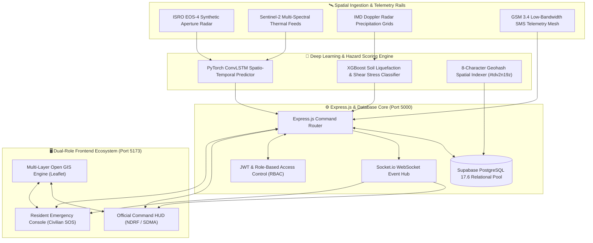
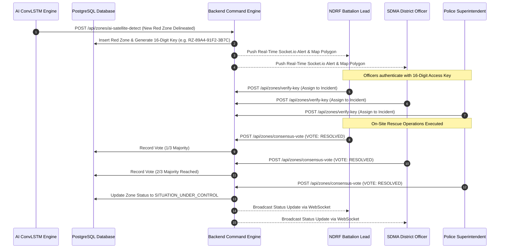
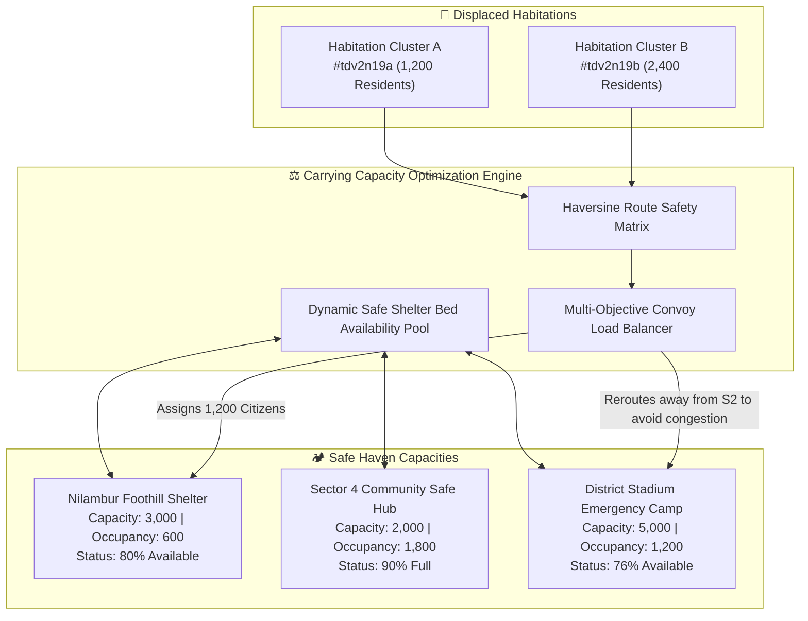
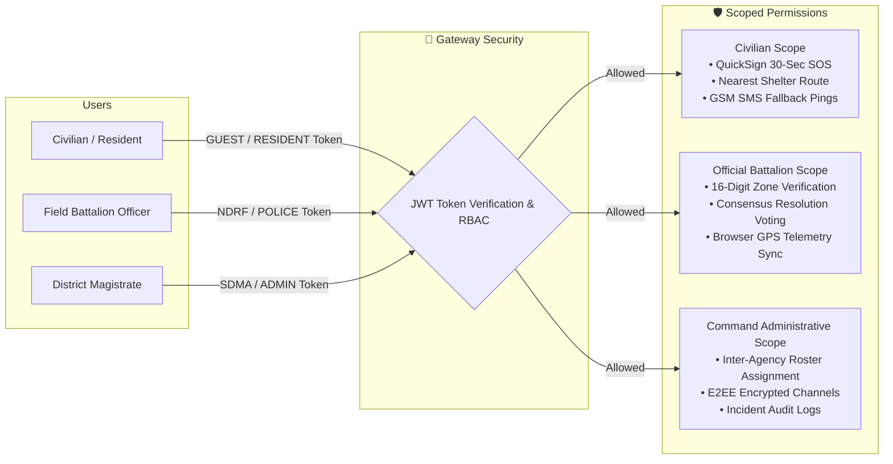
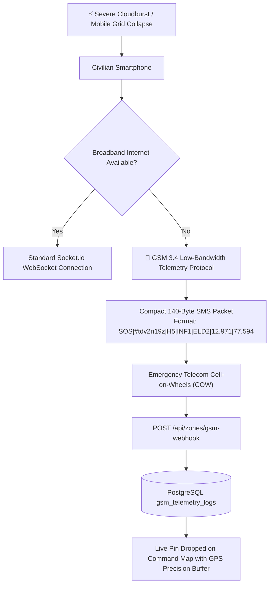

<!-- Animated Header Wave -->

<!-- Animated Dynamic Typing Banner -->

 

> **SIH 2026 Problem Statement 26191**: Intelligent Identification of Hazard-Based Red Zones, Carrying Capacity Assessment, and Immediate Relocation Needs.  
> **Development Team**: ADAMAS University  
> **Target Authorities**: Ministry of Home Affairs (MHA), National Disaster Response Force (NDRF), State Disaster Management Authorities (SDMA).

---

## 1. High-Level System Architecture

---

## 2. Multi-Agency Consensus Resolution Architecture

When an active Red Zone is declared by the AI engine, transitioning it to **"Situation Under Control"** requires consensus among multi-agency commanders deployed on site:

---

## 3. Dynamic Shelter Carrying Capacity Balancing

The platform prevents relief camp overload and road bottlenecks using a spatial carrying capacity optimization algorithm:

---

## 4. Dual-Role Security & Isolation Architecture

The platform separates civilian and administrative privileges with strict role boundaries:

---

## 5. Offline Fallback Architecture (GSM 3.4 Telemetry)

When commercial 4G/5G mobile tower grids collapse during extreme cloudbursts or landslides, SurakshaDrishti activates a resilient fallback:

---

<!-- Animated Footer Wave -->

**SurakshaDrishti Architectural Specification**  
*SIH 2026 Problem Statement 26191 • Developed by ADAMAS University Team*

