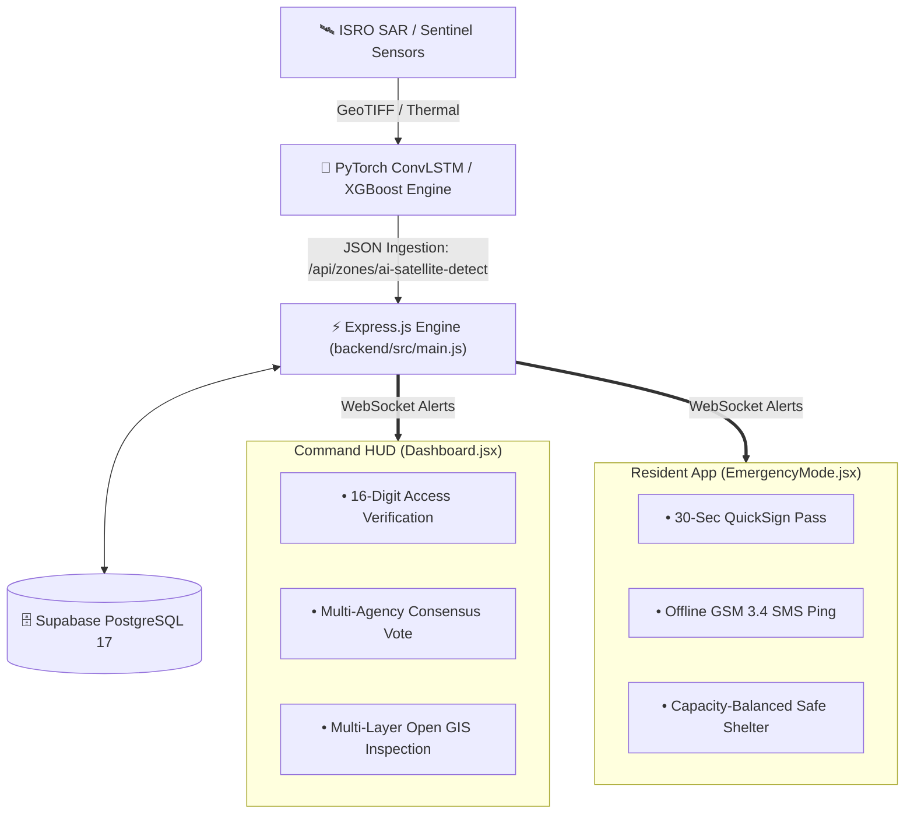

<!-- Animated Header Wave -->

<!-- Animated Dynamic Typing Banner -->

 

> **Project**: SurakshaDrishti — Multi-Hazard Red Zone & Relocation Decision Platform  
> **Team**: ADAMAS University (SIH 2026 Problem Statement 26191)  
> **Authority Context**: Ministry of Home Affairs (MHA), NDRF, and SDMA  

---

## 📑 Table of Contents

1. [Backend Engine & Handlers](#1-backend-engine--handlers)
2. [Backend API Routes](#2-backend-api-routes)
3. [Frontend Core & Utilities](#3-frontend-core--utilities)
4. [Frontend Components & Viewports](#4-frontend-components--viewports)
5. [Frontend Sub-Pages](#5-frontend-sub-pages)
6. [Data Flow & Inter-Process Communication](#6-data-flow--inter-process-communication)

---

## 1. Backend Engine & Handlers

### `backend/src/main.js`

- **Working Principle**: The primary HTTP server and WebSocket entry point.
- **Key Operations**:
  - Initializes the Express application with CORS, JSON body parsers, and proxy trust settings (`trust proxy: 1`).
  - Attaches rate-limiting middleware (`API_Limiter`) to authentication, zones, feedback, and profile routes.
  - Boots up the Socket.io WebSocket server on top of native Node HTTP server.
  - Enforces JWT authentication middleware on incoming socket handshakes.
  - Manages real-time room subscriptions (`zone_${zoneId}` and `chat_${conversationId}`) for dispatching live threat updates and encrypted field messages.

### `backend/handlers/dbHandler.js`

- **Working Principle**: The central PostgreSQL database connection and query manager.
- **Key Operations**:
  - Maintains a pooled connection to Supabase PostgreSQL 17 via `pg.Pool`.
  - Exposes sanitized database query helper functions (`query`, `getClient`).
  - Implements spatial query macros for calculating Haversine distance, H3/S2 geohash boundaries, and point-in-polygon containment checks for red zones.
  - Houses database initialization migrations and seed scripts for hazard perimeters and relief shelters.

### `backend/handlers/middlewareHandler.js`

- **Working Principle**: Security gatekeeper and request sanitizer.
- **Key Operations**:
  - `FN_verifyTkn`: Extracts and verifies JWT bearer tokens from request headers; attaches decoded user payloads (`userId`, `role`, `operatingMode`) to `req.user`.
  - `API_Limiter`: Configurable window-based rate limiting to prevent brute-force attacks on sensitive endpoints.
  - `handle404` & `masterErrorHandler`: Global error catching and normalized JSON error reporting.

### `backend/handlers/aiAssistent.js`

- **Working Principle**: Local / edge AI inference runner.
- **Key Operations**:
  - Bridges the backend to local Ollama inference models or remote PyTorch ConvLSTM hazard microservices.
  - Formats threat assessment prompts and summarizes multi-agency consensus logs into operational intelligence reports.

---

## 2. Backend API Routes

### `backend/routes/auth.js`

- **Working Principle**: Multi-role authentication and identity validation.
- **Endpoints & Principles**:
  - `POST /api/auth/register`: Validates credentials, checks role privileges (`RESIDENT`, `NDRF`, `SDMA`, `POLICE`), hashes passwords with bcrypt, and provisions a new user record.
  - `POST /api/auth/login`: Authenticates credentials and issues signed JWT bearer tokens.
  - `POST /api/auth/quick-sign`: **QuickSign 30-Second Emergency Pass** generator. Bypasses 2FA during active disasters to generate a signed emergency access token, assigning the nearest safe haven.
  - `POST /api/auth/verify-otp`: Validates 6-digit email / SMS OTP verification codes via Nodemailer.

### `backend/routes/zones.js`

- **Working Principle**: Real-time hazard zone delineation and consensus resolution management.
- **Endpoints & Principles**:
  - `GET /api/zones`: Fetches all active red zones with severity indices, bounding GeoJSON polygons, and assigned officers.
  - `POST /api/zones/verify-key`: Validates the **16-digit cryptographic access key** (e.g. `RZ-89A4-91F2-3B7C`) before assigning an officer to an active battalion.
  - `POST /api/zones/consensus-vote`: Records an officer's vote towards transitioning a zone to "Situation Under Control". When majority threshold is achieved across agencies, the zone status updates automatically.
  - `POST /api/zones/ai-satellite-detect`: Ingestion webhook for ISRO / Sentinel satellite anomaly detection models.

### `backend/routes/chat.js`

- **Working Principle**: End-to-End Encrypted (E2EE) inter-agency communication rails.
- **Endpoints & Principles**:
  - `GET /api/chat/conversations`: Retrieves authorized channels for field battalions, emergency coordinators, and magistrates.
  - `POST /api/chat/messages`: Stores encrypted message payloads and emits real-time WebSocket events to connected battalion radios.
  - Enforces strict role-based separation so civilian users cannot intercept command channels.

### `backend/routes/profile.js`

- **Working Principle**: User account, agency badge, and duty mode management.
- **Endpoints & Principles**:
  - Handles toggle between `ON_SITE` (field dispatch) and `OFF_SITE` (remote command) modes.
  - Stores officer GPS tracking preferences and emergency contact rosters.

### `backend/routes/feedback.js`

- **Working Principle**: Post-incident auditing and citizen grievance logging.
- **Endpoints & Principles**:
  - Records shelter condition reports, supply shortages, and field response quality metrics for NDRF administrative review.

---

## 3. Frontend Core & Utilities

### `frontend/src/main.jsx`

- **Working Principle**: React 18 client entry point.
- **Key Operations**:
  - Mounts `<App />` inside `#root`.
  - Imports global CSS (`index.css`) and Leaflet GIS styling sheets.
  - Wraps the application inside a React `<ErrorBoundary />` to gracefully catch and display runtime exceptions without crashing the UI.

### `frontend/src/App.jsx`

- **Working Principle**: Global view router, modal orchestrator, and state coordinator.
- **Key Operations**:
  - Manages top-level state: active user session, auth modals, emergency SOS modal, and QuickSign dialog.
  - Controls the smooth crossfading sequence between `<IntroSequence />` and the primary landing page.
  - Renders `<Navbar />` at top-level viewport, automatically unmounting it when any modal window opens.
  - Handles client-side routing across `/`, `/privacy`, `/terms`, `/faqs`, and `/documentation`.

### `frontend/src/index.css`

- **Working Principle**: Global design system, typography tokens, and GPU-accelerated animation physics.
- **Key Operations**:
  - Sets root font definitions (`Outfit` for headings, `Plus Jakarta Sans` for body, `Space Grotesk` for telemetry).
  - Configures `.reveal`, `.reveal-tilt-left`, `.reveal-drop`, and `.reveal-tilt-right` cubic-bezier entrance transitions.
  - Defines warm ivory paper texture, ambient glow layers, and mobile drawer frosted blur keyframes.

### `frontend/src/utils/useScrollReveal.js`

- **Working Principle**: Intersection Observer scroll trigger.
- **Key Operations**:
  - Attaches to elements and sets `isRevealed = true` when they enter the viewport.
  - Resets state when elements leave the viewport so animations **replay every single time you scroll** up or down.

### `frontend/src/utils/useCountUp.js`

- **Working Principle**: Frame-by-frame numeric telemetry counter.
- **Key Operations**:
  - Eased count-up animation (`1 - Math.pow(1 - progress, 3)`) counting from 0 to target metrics.
  - Resets and recounts whenever the section scrolls into view.

### `frontend/src/utils/api.js`

- **Working Principle**: Centralized client REST communication module.
- **Key Operations**:
  - Manages base URL configuration (`http://localhost:5000` or production URL).
  - Injects stored JWT tokens into `Authorization: Bearer <token>` headers.
  - Provides standardized helpers (`api.get`, `api.post`, `api.put`, `api.delete`).

---

## 4. Frontend Components & Viewports

### `frontend/src/components/Navbar.jsx`

- **Working Principle**: Floating shrinking capsule navigation dock.
- **Key Operations**:
  - Stays fixed at viewport top (`z-[9995]`).
  - Listens to scroll position: automatically compresses from `max-w-6xl` to a centered rounded pill (`max-w-4xl`, `rounded-full`, `backdrop-blur-2xl`) on scroll past 40px.
  - Unmounts when any modal window opens.
  - Features an animated mobile hamburger icon that morphs into an "X" with subtle frosted glass drawer reveal.

### `frontend/src/components/GovernmentLanding.jsx`

- **Working Principle**: Minimalist government hero presentation.
- **Key Operations**:
  - Displays high-impact headlines, SIH 26191 authority pills, and dual entry paths:
    1. *Official Command Console* (requires 16-digit zone access key).
    2. *Civilian Evacuation SOS* (one-tap instant emergency pass).
  - Houses the interactive 3D perspective tilt container with specular light glare.

### `frontend/src/components/Interactive3DCard.jsx`

- **Working Principle**: Physical mouse coordinate 3D perspective tilt engine.
- **Key Operations**:
  - Listens to `mousemove` coordinates relative to card bounding rect.
  - Computes `rotateX` and `rotateY` degrees dynamically.
  - Moves a specular gradient glare reflection opposite to cursor angle.
  - Smoothly resets to level plane on `mouseleave`.

### `frontend/src/components/LiveStatsStrip.jsx`

- **Working Principle**: Real-time KPI telemetry ticker.
- **Key Operations**:
  - Renders 5 key metrics: Active Red Zones (14), Vulnerable Habitations (1,420), Safe Havens (8,500), Relocated Citizens (42,890), Urgent Actions (3).
  - Uses `useCountUp` and staggered parallax scroll reveals to animate numbers on entry.

### `frontend/src/components/FeaturesShowcase.jsx`

- **Working Principle**: 6-card modular capability grid.
- **Key Operations**:
  - Outlines the 6 technological pillars: Sub-Meter Geohash Grid, Shelter Carrying Capacity, Proactive Transit Corridors, GSM 3.4 Offline Telemetry, E2EE Command Channels, and Dual Operating Roles.
  - Cards feature 3D perspective tilt and staggered scroll unmasking.

### `frontend/src/components/HowItWorks.jsx`

- **Working Principle**: Directional pipeline resolution workflow.
- **Key Operations**:
  - Sequentially demonstrates how disaster data flows from raw sensors to evacuation orders:
    - *Stage 01*: Data Ingestion (glides in from left with tilt).
    - *Stage 02*: Hazard Scoring AI (descends from above).
    - *Stage 03*: Vulnerability Overlay (rises from below).
    - *Stage 04*: Relocation AI Matrix (sweeps from right with counter-tilt).
  - Connects cards via animated directional pulsing gold arrows (`.animate-arrow-pulse`).

### `frontend/src/components/CTASection.jsx`

- **Working Principle**: Urgent operational mobilization banner.
- **Key Operations**:
  - Presents dual action paths: civilian 30-sec QuickSign registration and battalion officer sign-in.

### `frontend/src/components/Footer.jsx`

- **Working Principle**: Official attribution and statutory compliance footer.
- **Key Operations**:
  - Links to `/privacy`, `/terms`, `/faqs`, `/documentation`.
  - Preserves exact scroll offsets when navigating away from the home page.

### `frontend/src/components/RealGoogleMap.jsx`

- **Working Principle**: Open GIS Leaflet map viewport.
- **Key Operations**:
  - Renders multi-layer maps without proprietary Google API keys using OpenStreetMap, CARTO Dark, and Esri Satellite tile layers.
  - Visualizes red zone threat perimeters, relief shelter markers, and real-time civilian SOS beacon pulses.

### `frontend/src/components/Dashboard.jsx`

- **Working Principle**: Official NDRF / SDMA command console.
- **Key Operations**:
  - Displays inter-agency battalion rosters, active incident feeds, 16-digit access key verification dialog, and live consensus resolution voting bars.

### `frontend/src/components/EmergencyMode.jsx`

- **Working Principle**: Civilian crisis mode viewport.
- **Key Operations**:
  - High-visibility emergency UI with one-tap SOS beacon, automatic GPS coordinate broadcaster, offline route instructions, and direct NDRF helpline dials.

### `frontend/src/components/QuickSignModal.jsx`

- **Working Principle**: 30-second rapid evacuation registration pass.
- **Key Operations**:
  - Bypasses traditional authentication friction during active disasters.
  - Collects household headcount, infant/elderly flags, and immediately issues a cryptographically-signed digital evacuation pass paired with the nearest available shelter.

### `frontend/src/components/IntroSequence.jsx`

- **Working Principle**: Cinematic radar calibration loader.
- **Key Operations**:
  - Simulates satellite telemetry synchronization over 5 milestones.
  - Concurrently crossfades out over 1000ms (`blur(20px) → 0`) as the landing page fades in.

---

## 5. Frontend Sub-Pages

### `frontend/src/components/pages/Documentation.jsx`

- **Working Principle**: Full system architecture and developer specification manual with chapter jump links.

### `frontend/src/components/pages/Faqs.jsx`

- **Working Principle**: 10 comprehensive technical questions and answers covering zero-API map engines, carrying capacity math, and GSM fallback.

### `frontend/src/components/pages/PrivacyPolicy.jsx`

- **Working Principle**: Statutory data governance policies aligned with the **Disaster Management Act, 2005** and Digital Personal Data Protection (DPDP) Act.

### `frontend/src/components/pages/TermsOfService.jsx`

- **Working Principle**: Official operational directives and rules of engagement for civilian passes and authorized battalion accounts.

---

## 6. Data Flow & Inter-Process Communication

 

<!-- Animated Footer Wave -->

**SurakshaDrishti File-by-File Technical Instructions**  
*SIH 2026 Problem Statement 26191 • Developed by ADAMAS University Team*

