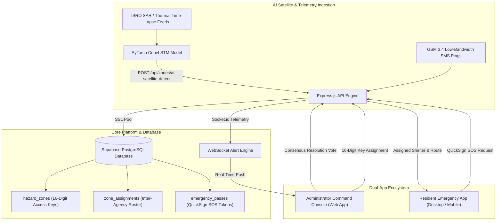

# SurakshaDrishti — Intelligent Red Zone & Relocation Decision Platform

> **SIH Problem Statement 26191**: Intelligent Identification of Hazard-Based Red Zones, Carrying Capacity Assessment, and Immediate Relocation Needs for Vulnerable Habitations.  
> **Ministry of Home Affairs & NDRF Disaster Management Division**

---

## Tech Stack & Core Engine

---

## System Architecture Diagram

---

## Core System Capabilities

### 1. Web Command Console (Administrator Only)
The Web Application is designed exclusively for NDRF Commanders, SDMA Regional Officers, Fire Chiefs, and Police Administrators.
- **16-Digit Security Access Keys**: Each hazard zone has a unique key (e.g. `RZ-89A4-91F2-3B7C`) required for officer assignment.
- **Consensus Resolution Voting**: A Red Zone transitions to "Situation Under Control" only when assigned inter-agency officers reach majority consensus.
- **Interactive GIS Map Overlay**: Renders real-time hazard perimeters alongside **blue pulsing markers** tracking citizens trapped inside Red Zones.
- **Browser Automatic GPS**: Captures live officer coordinates automatically via native browser geolocation.

### 2. Resident App Ecosystem (Electron / Mobile App)
- **QuickSign Emergency SOS Passes**: 30-second registration bypasses standard 2FA delays during active disasters.
- **GSM 3.4 Telecommunication Fallback**: Enables low-bandwidth location pings when mobile tower data networks fail.
- **Carrying Capacity Shelter Assignment**: Automatically assigns citizens to the nearest safe shelter with available capacity.

---

## Database Schema Highlights

The database is powered by Supabase PostgreSQL 17.6 and maintains 11 primary tables:
- `users`: Dual role accounts (`RESIDENT`, `NDRF`, `SDMA`, `POLICE`) and operating modes (`ON_SITE`, `OFF_SITE`).
- `hazard_zones`: AI hazard perimeters, risk scores, H3/S2 spatial geohashes, and 16-digit access keys.
- `zone_assignments`: Inter-agency officer roster and consensus resolution votes.
- `shelters`: Safe haven capacities, real-time occupancy, and evacuation corridors.
- `emergency_passes`: QuickSign priority digital SOS passes.
- `e2ee_conversations` & `e2ee_messages`: End-to-end encrypted inter-departmental channels.
- `gsm_telemetry_logs`: Low-bandwidth SMS disaster telemetry packets.

---

## Detailed Technical Documentation

For line-by-line code breakdowns, route specifications, and schema migration details, inspect:
- [BACKEND_ARCHITECTURE.md](file:///d:/Programming/Hackathon-SIH/BACKEND_ARCHITECTURE.md)
