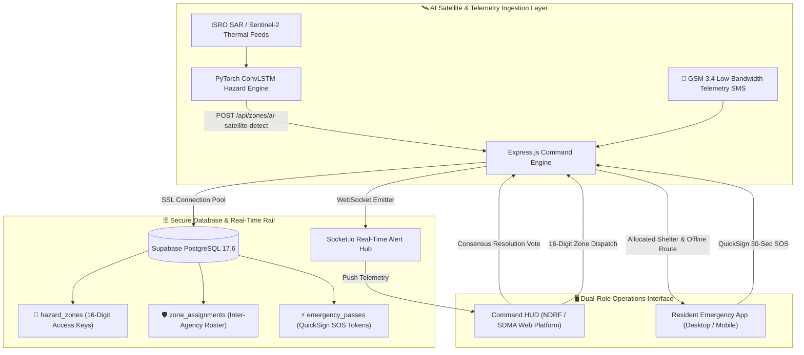

<div align="center">

<!-- Standard Animated Header Wave with Title Directly on the Wave -->

<!-- Animated Dynamic Typing Banner -->


<br/>

<!-- System Telemetry & Authority Badges -->
<p align="center">
  <a href="https://smartindiahackathon.gov.in">
    
  </a>
  &nbsp;
  <a href="https://ndrf.gov.in">
    
  </a>
  &nbsp;
  <a href="#-core-system-capabilities">
    
  </a>
</p>

<!-- Problem Statement Card -->
> 🚨 **SIH Problem Statement 26191**: Intelligent Identification of Hazard-Based Red Zones, Dynamic Carrying Capacity Assessment of Safer Relocation Sites, and Immediate Prioritization of Vulnerable Habitations.

</div>

---

## ⚡ Tech Stack & Architecture

<div align="center">

| 🖥️ Frontend & Visualization | ⚙️ Backend & Engine | 🗄️ Database & Real-Time | 🛰️ AI & Spatial Telemetry |
| :---: | :---: | :---: | :---: |
|  |  |  |  |
|  |  |  |  |
|  |  |  |  |

</div>

---

## 🛰️ System Architecture Flow



---

## 💎 Core System Capabilities

### 🎖️ 1. Official Command & Consensus Console (NDRF / SDMA)

* 🔐 **16-Digit Cryptographic Zone Passkeys**: Each active red zone generates an isolated 16-character access key (e.g. `RZ-89A4-91F2-3B7C`) required for authorized battalion officers to join incident dispatch.
* 🗳️ **Inter-Agency Consensus Voting**: Red Zones transition to **"Situation Controlled"** only when all assigned multi-agency commanders (NDRF, SDMA, Fire, Police) cast an authenticated consensus vote.
* 🗺️ **Multi-Layer Tactical GIS HUD**: Open-source GIS rendering (OpenStreetMap, CARTO Dark, Esri Satellite) plotting red hazard perimeters alongside real-time civilian SOS coordinates.
* 📍 **Native Browser GPS Calibration**: Automated field officer coordinate sync without external geolocation API costs or failure points.

---

### 🚨 2. Resident Emergency & Evacuation Ecosystem

* ⚡ **QuickSign 30-Second Emergency Pass**: Generates authenticated digital evacuation passes instantly without standard 2FA bottlenecks during landslides or flash floods.
* 📡 **GSM 3.4 Offline Telemetry Mesh**: Dispatches low-bandwidth geohash SMS alerts through local towers when broadband/cellular internet grids collapse.
* 🏕️ **Dynamic Shelter Carrying Capacity**: Multi-objective spatial algorithms allocate residents across safe sites to avoid road bottlenecks or overloaded relief camps.
* 🧭 **8-Character Spatial Geohashing**: Sub-meter resolution indexing (`#tdv2n19z`) for instant hazard evaluation across millions of coordinates.

---

## 🗃️ Database Schema Architecture

The relational data backbone operates on **Supabase PostgreSQL 17.6** across 11 synchronized tables:

| Table | Primary Responsibility |
| :--- | :--- |
| `users` | Role-based accounts (`RESIDENT`, `NDRF`, `SDMA`, `POLICE`) & operating modes (`ON_SITE`, `OFF_SITE`). |
| `hazard_zones` | AI hazard perimeters, risk scores (0–100), H3/S2 spatial geohashes, and 16-digit access keys. |
| `zone_assignments` | Inter-agency battalion rosters, deployment tracking, and multi-officer consensus resolution votes. |
| `shelters` | Safe haven carrying capacities, real-time bed occupancy, food/medical supply indices, and corridors. |
| `emergency_passes` | QuickSign digital SOS evacuation tokens and offline passes. |
| `e2ee_conversations` | End-to-end encrypted dispatch channels between field battalions and district magistrates. |
| `e2ee_messages` | Zero-knowledge encrypted message payloads. |
| `gsm_telemetry_logs` | Low-bandwidth disaster SMS packet archives. |

---

## 🚀 Quick Start & Local Development

### Prerequisites

- **Node.js**: v18.0.0 or higher (v20+ recommended)
- **npm**: v9.0.0+

### 1️⃣ Clone the Repository

```bash
git clone https://github.com/Babin123456/SurakshaDrishti.git
cd SurakshaDrishti
```

### 2️⃣ Backend Configuration

```bash
cd backend
npm install
node src/main.js
```

> Server starts on port `5000` (or `process.env.PORT`) with active WebSocket listener.

### 3️⃣ Frontend Configuration

```bash
cd ../frontend
npm install
npm run dev
```

> 🌐 Access the live web interface at `http://localhost:5173`

---

## 📚 Project Documentation Hub

For granular architectural diagrams, file-by-file working principles, and subsystem manuals:

| Document | Description |
| :--- | :--- |
| 📖 [**INSTRUCTIONS.md**](./INSTRUCTIONS.md) | Comprehensive file-by-file breakdown explaining the exact working principle, inputs, and outputs of every component, handler, route, and utility. |
| 🏗️ [**ARCHITECTURE.md**](./ARCHITECTURE.md) | In-depth Mermaid sequence and flow diagrams detailing high-level topology, multi-agency consensus resolution voting, and shelter carrying capacity balancing. |
| 🧠 [**AI Prediction Architecture**](./ai_prediction_architecture.md) | Deep learning specifications for time-series ConvLSTM, ViViT spatio-temporal modeling, and H3/S2 geohash anomaly heatmaps. |
| 🗄️ [**Detailed Backend Architecture**](./BACKEND_ARCHITECTURE.md) | Line-by-line breakdown of Express route handlers, PostgreSQL DDL migrations, transaction integrity, and Socket.io channel topology. |
| 🖥️ [**Frontend README**](./frontend/README.md) | Client-side architecture, 3D tilt engine, shrinking capsule navbar, design system tokens, and component directory tree. |
| ⚙️ [**Backend README**](./backend/README.md) | Server-side command engine, Socket.io event channels, PostgreSQL schema matrix, and REST API route registry. |
| ⚖️ [**LICENSE**](./LICENSE) | Official Open-Source MIT License attributed to ADAMAS University (SIH 2026). |

---

## 📄 License & Acknowledgements

* **Hackathon**: Developed for Smart India Hackathon (SIH 2026) under Problem Statement **26191**.
* **Institution**: **ADAMAS University** — SurakshaDrishti Team.
* **Governing Body**: Ministry of Home Affairs (MHA), National Disaster Response Force (NDRF), and State Disaster Management Authorities (SDMA).
* **License**: Released under the permissive [MIT License](./LICENSE).

<br/>

<div align="center">

<!-- Standard Animated Footer Wave -->


**SurakshaDrishti — Prepared for Crisis. Engineered for Survival.** 🇮🇳

</div>
