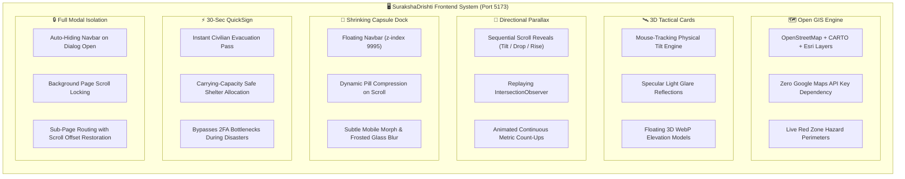

<div align="center">

<!-- Animated Header Wave -->


```
 ███████╗██╗   ██╗██████╗  █████╗ ██╗  ██╗███████╗██╗  ██╗ █████╗ ██████╗ ██████╗ ██╗███████╗██╗  ██╗████████╗██╗
 ██╔════╝██║   ██║██╔══██╗██╔══██╗██║ ██╔╝██╔════╝██║  ██║██╔══██╗██╔══██╗██╔══██╗██║██╔════╝██║  ██║╚══██╔══╝██║
 ███████╗██║   ██║██████╔╝███████║█████╔╝ ███████╗███████║███████║██║  ██║██████╔╝██║███████╗███████║   ██║   ██║
 ╚════██║██║   ██║██╔══██╗██╔══██║██╔═██╗ ╚════██║██╔══██║██╔══██║██║  ██║██╔══██╗██║╚════██║██╔══██║   ██║   ██║
 ███████║╚██████╔╝██║  ██║██║  ██║██║  ██╗███████║██║  ██║██║  ██║██████╔╝██║  ██║██║███████║██║  ██║   ██║   ██║
 ╚══════╝ ╚═════╝ ╚═╝  ╚═╝╚═╝  ╚═╝╚═╝  ╚═╝╚══════╝╚═╝  ╚═╝╚═╝  ╚═╝╚═════╝ ╚═╝  ╚═╝╚═╝╚══════╝╚═╝  ╚═╝   ╚═╝   ╚═╝
```

### 🛰️ Next-Gen GIS Multi-Hazard Red Zone Identification & Relocation Decision Platform

<!-- Animated Dynamic Typing Banner -->


<br/>

[](https://vitejs.dev/)
[](https://reactjs.org/)
[](https://reactrouter.com/)
[](https://tailwindcss.com/)
[](https://leafletjs.com/)
[](https://lenis.darkroom.engineering/)

</div>

---

## 🧭 Executive Overview

**SurakshaDrishti** (*Protection Vision*) is an enterprise-grade geospatial decision-support platform engineered for the **National Disaster Response Force (NDRF)** and **State Disaster Management Authorities (SDMAs)** under Smart India Hackathon **Problem Statement 26191**.

The frontend application features:
- **Floating Shrinking Capsule Navbar:** Docked at top (`z-[9995]`), dynamically shrinking into a compact pill (`w-[94%] max-w-4xl`, `backdrop-blur-2xl`) on scroll past 40px, and automatically unmounting during modal dialogs.
- **Interactive 3D Physical Tilt Engine:** Cards track mouse coordinates with physical perspective, dynamic rotation (`rotateX`, `rotateY`), and moving specular light glare.
- **Cinematic Scroll Parallax Reveals:** Sections unmask sequentially on scroll with directional transitions (left-tilt, drop, rise, right-tilt) and dynamic count-up statistics that re-animate on every scroll.
- **Subtle iOS-Grade Mobile Drawer:** Animated three-line hamburger toggle smoothly morphing into an "X" with lens-blur frosted glass backdrop dissolution.
- **Zero Google Maps API Key Dependency:** Native open GIS viewport powered by public OpenStreetMap, CARTO Dark, and Esri Satellite tile sets.
- **Sub-Page Navigation with Scroll Restoration:** Seamless routing between `/`, `/documentation`, `/faqs`, `/privacy`, and `/terms`.

---

## ⚡ Core Frontend Capabilities
 


---

## 🗂️ Component Directory Structure

```
frontend/
├── public/
│   ├── favicon.webp                     # Browser tab emblem
│   ├── stat_hazard_gauge.webp           # Active Red Zones metric gauge
│   ├── stat_high_risk_radar.webp        # High-Risk Habitations radar
│   ├── stat_biometric_shield.webp       # Protected Population shield
│   ├── stat_shelter_bunker.webp         # Shelter Capacity bunker
│   ├── stat_critical_bell.webp          # Active Alerts bell
│   ├── feature_gsm_relay.webp           # GSM 3.4 Telecommunication mesh
│   ├── feature_e2ee_lock.webp           # E2EE Interdepartmental lock
│   ├── feature_geohash_grid.webp        # Geohash spatial index
│   ├── feature_dual_roles.webp          # Dual role privilege module
│   ├── feature_carrying_capacity.webp   # Capacity balance allocator
│   ├── feature_proactive_evacuation.webp# Relocation corridor router
│   ├── pipeline_satellite.webp          # Stage 01: ISRO SAR ingestion
│   ├── pipeline_ai_core.webp            # Stage 02: Hazard scoring neural net
│   ├── pipeline_vulnerability.webp      # Stage 03: Sub-meter demographics
│   ├── pipeline_rescue_drone.webp       # Stage 04: Safe haven dispatch
│   ├── doc_architecture_blueprint.webp # Documentation blueprint header
│   ├── faq_holographic_orb.webp         # FAQ holographic orb header
│   ├── legal_compliance_shield.webp     # Legal compliance shield header
│   └── cta_emergency_pass.webp          # QuickSign modal emblem
├── src/
│   ├── components/
│   │   ├── Navbar.jsx                   # Floating shrinking capsule dock
│   │   ├── GovernmentLanding.jsx        # Minimalist government hero presentation
│   │   ├── LiveStatsStrip.jsx           # Live geospatial telemetry count-up strip
│   │   ├── FeaturesShowcase.jsx         # 6-card 3D architecture showcase
│   │   ├── HowItWorks.jsx               # Directional animated pipeline sequence
│   │   ├── CTASection.jsx               # One-tap operational mobilization
│   │   ├── Footer.jsx                   # Official authorities & legal links
│   │   ├── Interactive3DCard.jsx        # Mouse coordinate 3D tilt & glare engine
│   │   ├── IntroSequence.jsx            # Crossfade initialization loader
│   │   ├── Dashboard.jsx                # Official command console
│   │   ├── AuthSection.jsx              # Official authentication modal
│   │   ├── EmergencyMode.jsx            # Emergency civilian SOS console
│   │   ├── QuickSignModal.jsx           # 30-second rapid evacuation pass
│   │   └── pages/                       # Multi-page subpage views
│   │       ├── Documentation.jsx
│   │       ├── Faqs.jsx
│   │       ├── PrivacyPolicy.jsx
│   │       └── TermsOfService.jsx
│   ├── utils/
│   │   ├── useScrollReveal.js           # Replaying scroll intersection observer
│   │   └── useCountUp.js                # Continuous telemetry metric counter
│   ├── App.jsx                          # Main routing & state coordinator
│   └── index.css                        # Modern design system & typography tokens
```

---

## 🎨 Design System & Typography

| Font Family | Style / Role | Implementation |
| :--- | :--- | :--- |
| **Outfit** | Primary Headlines & Bold Display Titles | `font-display` / `h1-h6` (`-0.025em` tracking) |
| **Plus Jakarta Sans** | Body Copy, Navigation, and Tactical Descriptions | `font-sans` (`-0.011em` tracking) |
| **Space Grotesk** | Monospace GPS, Geohashes, Badges, and Telemetry | `font-mono` |

### Color Palette
- **Canvas Background:** Warm Ivory Cream `#FDFBF7` with subtle texture (`paper-texture`)
- **Charcoal Typography:** Deep Carbon `#1A1A1A` and Soft Charcoal `#2C2A29`
- **Government Bronze / Gold:** Antique Gold `#8B7355` (Primary accents and badges)
- **Crisis Terracotta:** Rust Orange `#B85C38` (Red zone and emergency warnings)
- **Safe Relief Haven:** Forest Emerald `#2D7A4F` (Shelters and controlled indicators)

---

## 🚀 Quick Start & Local Development

### 1. Prerequisites
- **Node.js**: `v18.0.0` or higher (v20+ recommended)
- **npm**: `v9.0.0` or higher

### 2. Installation
```bash
cd frontend
npm install
```

### 3. Running Locally
```bash
npm run dev
```
> ⚡ Local Development Server launches on: **`http://localhost:5173`**

### 4. Production Build
```bash
npm run build
```
Generates minified production bundle in `frontend/dist/`.

---

<div align="center">

<!-- Animated Footer Wave -->


**SurakshaDrishti** — Prepared for Crisis. Engineered for Survival. 🇮🇳  
*Smart India Hackathon 2026 • Problem Statement #26191 • Developed by ADAMAS University Team*

</div>
