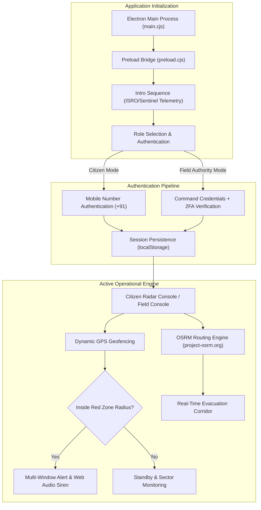
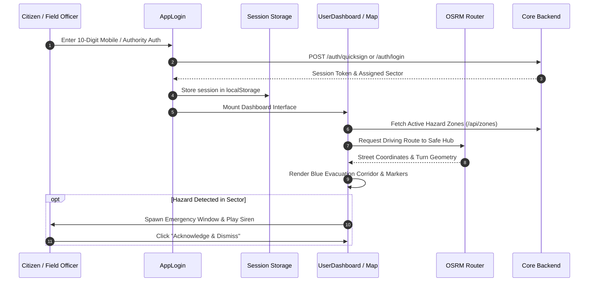

<div align="center">

<!-- Animated Header Wave with Title -->


<!-- Animated Dynamic Typing Subtitle -->


<br/>

<p align="center">
  
  &nbsp;
  
  &nbsp;
  
</p>

</div>

---

A cross-platform disaster response desktop and web client for civilians and field tactical personnel. Built on **Electron**, **React**, and **Leaflet GIS**, this application provides real-time multi-hazard proximity monitoring, dynamic evacuation corridor routing via OSRM, instant civil defense sirens, and zero-knowledge tactical field coordination.

---

## 1. System Architecture & Workflow



---

## 2. Core Working Principles

### 2.1 Civilian Proximity & Blast Radius Monitoring

- **Automated Geofencing:** Computes the Haversine distance between the user's detected coordinates and all active disaster perimeters (`ACTIVE_RED_ZONE` / `ACTIVE_WARNING_ZONE`).
- **Targeted Perimeter Filter:** Only renders active red zone danger buffers if the citizen is physically within the hazard radius, preventing panic in unaffected sectors.
- **Relief Hub Resolution:** Queries the backend dynamic shelter service (`/api/zones/shelters/dynamic`) to retrieve verified camps and high-capacity fallback centers (schools, hospitals) within reach.

### 2.2 Dynamic Evacuation Corridors (OSRM Engine)

- **Street-Level Polyline Generation:** Uses the Open Source Routing Machine (OSRM) driving API to plot actionable road routes from the user's location to the designated Relief Hub.
- **Failover Vector Fallback:** If external network routing is constrained or offline, gracefully draws a high-visibility direct evacuation corridor vector.
- **Camera Interpolation:** Smooth `flyToBounds` easing (1.8s, `easeLinearity: 0.25`) automatically aligns the viewport along the full path when switching hubs.

### 2.3 Standalone Emergency Warning Window & Siren

- **Dedicated Electron BrowserWindow:** Employs an independent, frameless, always-on-top window spawned via IPC (`trigger-alert`).
- **Web Audio API Siren:** Synthesizes an emergency civil defense siren tone (`800Hz <-> 600Hz` square-wave oscillation) directly through hardware speakers without relying on external audio assets.
- **Safe Teardown:** Closes cleanly upon citizen acknowledgment via `acknowledge-alert` IPC.

---

## 3. Directory Structure

```text
userApp/
├── backend/
│   ├── main.cjs            # Electron main process (window management, IPC handlers)
│   └── preload.cjs         # Context-isolated IPC bridge (electronAPI)
├── frontend/
│   ├── public/             # Static assets (favicon, branding)
│   ├── src/
│   │   ├── components/
│   │   │   ├── AgentDashboard.jsx      # Field tactical unit console
│   │   │   ├── AlertNotification.jsx   # Standalone emergency alert popup
│   │   │   ├── AppLogin.jsx            # Citizen phone login & Authority 2FA
│   │   │   ├── IntroSequence.jsx       # Initial GIS telemetry loader
│   │   │   ├── RealGoogleMap.jsx       # Leaflet GIS map with OSRM corridors
│   │   │   └── UserDashboard.jsx       # Citizen Radar Console & HUD
│   │   ├── utils/
│   │   │   └── api.js                  # Centralized backend HTTP communication
│   │   ├── App.jsx                     # Root application coordinator
│   │   ├── index.css                   # Tailwind base & custom design tokens
│   │   └── main.jsx                    # React DOM entry point
│   ├── index.html                      # HTML template
│   └── vite.config.js                  # Vite bundler configuration
├── package.json                        # Scripts and dependency specifications
├── postcss.config.cjs                  # PostCSS plugin settings
└── tailwind.config.js                  # Custom palette, typography, and animations
```

---

## 4. Prerequisites

- **Node.js:** v18.x or v20.x LTS
- **npm:** v9.x or higher
- **Backend API:** `adminDash/backend` running on `http://localhost:5000`

---

## 5. Setup & Installation

Navigate to the `userApp` directory:

```bash
cd d:/Projects/SurakshaDrishti/userApp
```

Install dependencies:

```bash
npm install
```

---

## 6. Execution Modes

### 6.1 Desktop App (Electron Development Mode)

Runs Vite dev server and launches the Electron desktop shell concurrently:

```bash
npm run electron
```

### 6.2 Browser Web Mode

Runs the client as a browser application accessible at `http://localhost:5173`:

```bash
npm run dev
```

### 6.3 Production Build

Compiles and bundles the frontend into `frontend/dist`:

```bash
npm run build
```

---

## 7. Operational Workflow



---

## 8. Technology Stack

- **Desktop Framework:** Electron v44
- **UI Framework:** React v18 + Vite v5
- **Mapping & GIS:** Leaflet v1.9, OpenStreetMap, CARTO Dark Tiles, Esri World Imagery
- **Routing:** OSRM (Open Source Routing Machine)
- **Styling:** TailwindCSS v3 (Dark Matte / Warm Creme Palette)
- **Icons:** Lucide React
- **Audio Engine:** Web Audio API (OscillatorNode Synthesizer)

<br/>

<div align="center">

<!-- Animated Footer Wave -->


**SurakshaDrishti UserApp — Rapid Civil Defense. Direct Evacuation. Built for Resilient Survival.**

</div>
